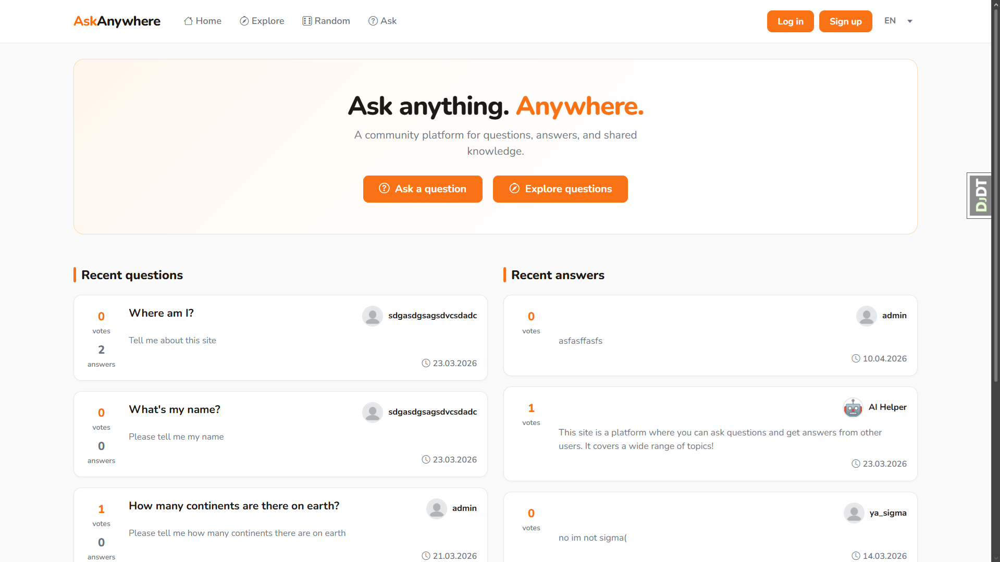
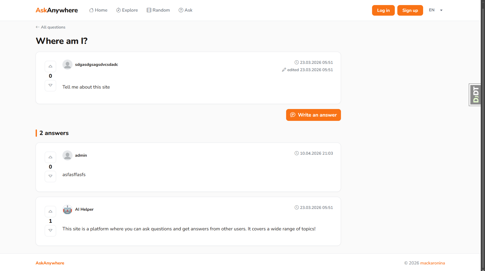

# Ask Anywhere

This web application is a platform for publishing questions and answers on various topics, written using the Python
language and the Django framework. Authorized users of the site can ask and answer questions, vote for their favorite
questions and answers. Question authors can mark answers as solutions to help other people. The questions you are
looking for can be found on the website by term and tags. The platform also has an AI bot that automatically answers
new questions. Try it here: https://ask-anywhere.onrender.com

### Demonstration

### Features

* Creating and logging into a user account. Optional email confirmation upon registration
* Posting of questions and answers by users. Markdown supported
* Marking an answer as a solution by the author of the question
* Ability to vote on questions and answers
* Optional automatic generation of answers using AI
* Search and sort questions by different criteria

### Used technology

* Python 3.12.7
* Django 6.0.2 (High-level Python web framework)
* Gunicorn (Python WSGI HTTP Server for UNIX)
* PostgreSQL (Relational database)
* [Cloudflare Workers AI](https://developers.cloudflare.com/workers-ai/) (API for accessing AI models. Has a free plan)
* [ImgBB API](https://api.imgbb.com) (Free image hosting and sharing service)
* Docker (Platform that enables developers to run containerized applications)

### Installation

* Start the PostgreSQL database using any method. With DEBUG enabled, the SQLite database will be used.
* Edit file example.env and fill it with your data including the data for connecting to the database, then rename it to
  .env. This file contains all the settings for the web application
* Commands to run without docker:  
  `pip install -r requirements.txt`  
  `python manage.py makemigrations`  
  `python manage.py migrate`  
  `python manage.py collectstatic`  
  `python manage.py test # Run the standard tests. These should all pass.`  
  `python manage.py createsuperuser # Create a superuser`  
  `python manage.py runserver`  
  Open tab to http://127.0.0.1:8000 to see the main site
* Commands to run with docker:  
  `docker build -t image .`  
  `docker run -p 8000:8000 image`  
  After this, the application will be available at http://localhost:8000